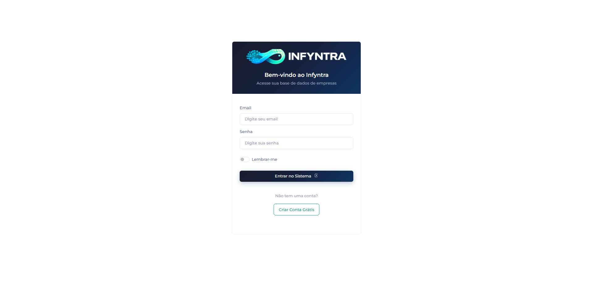
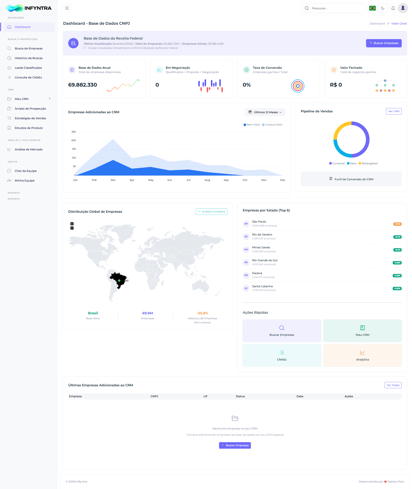
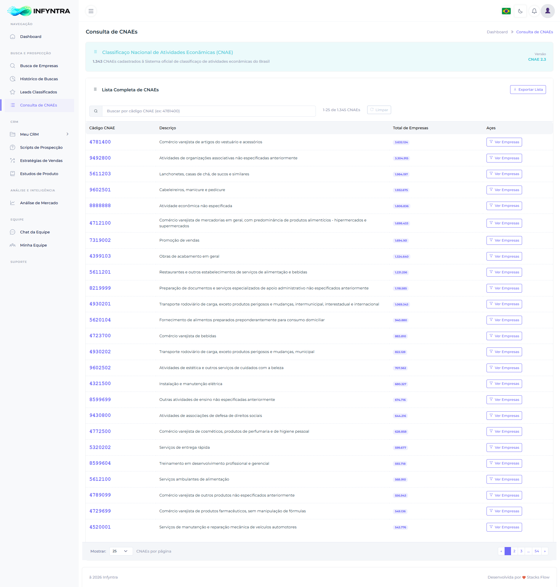
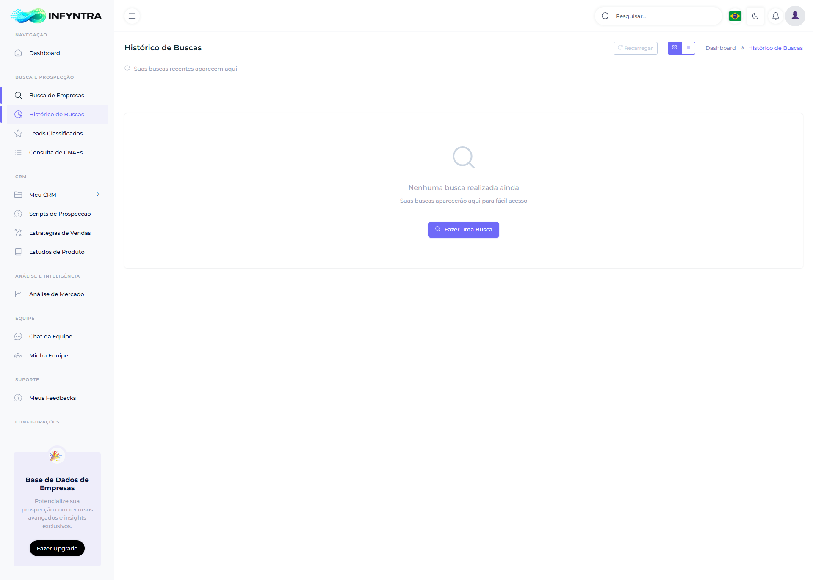
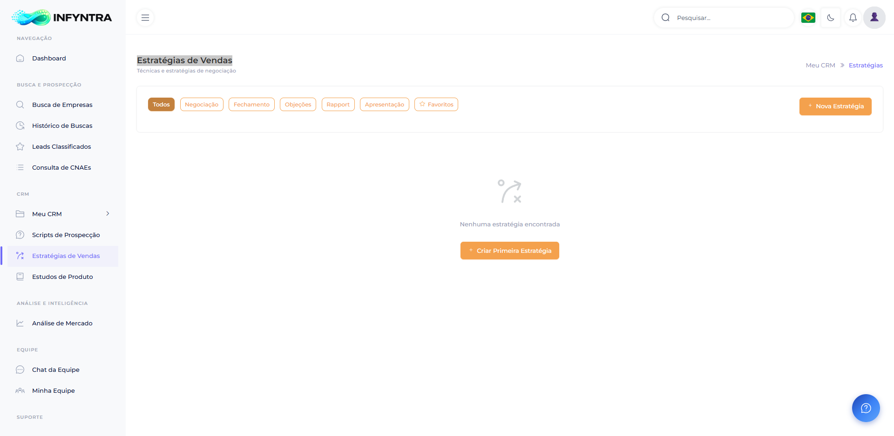
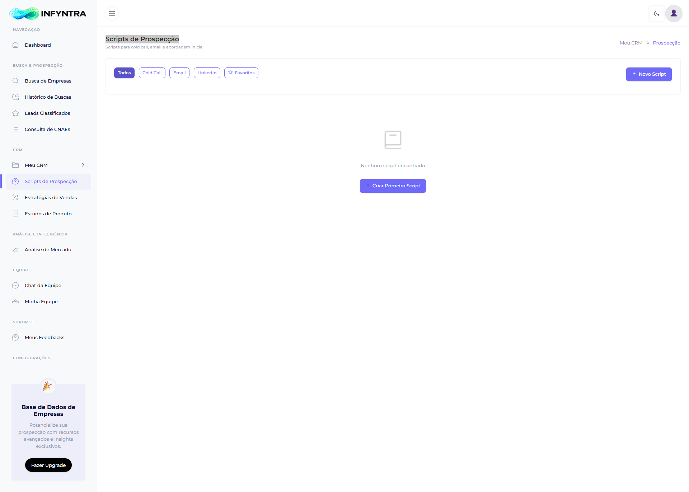
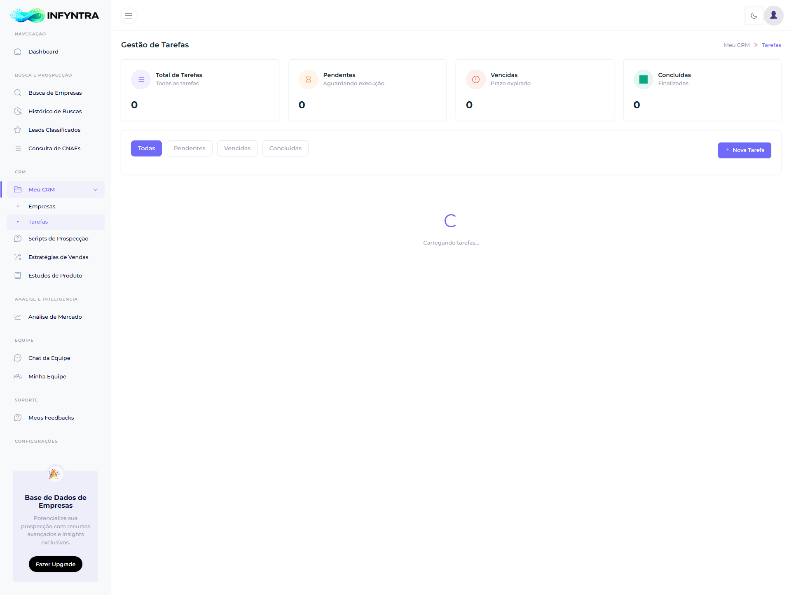
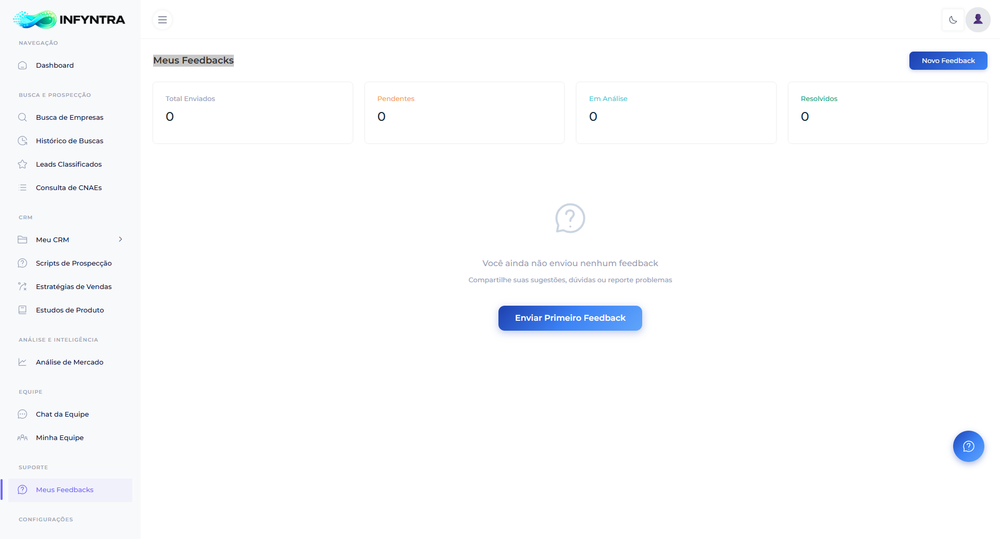
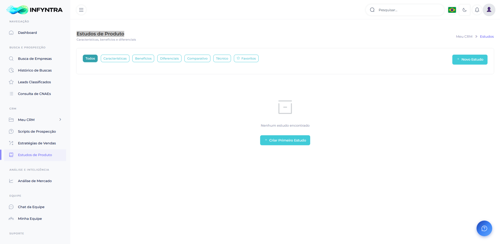
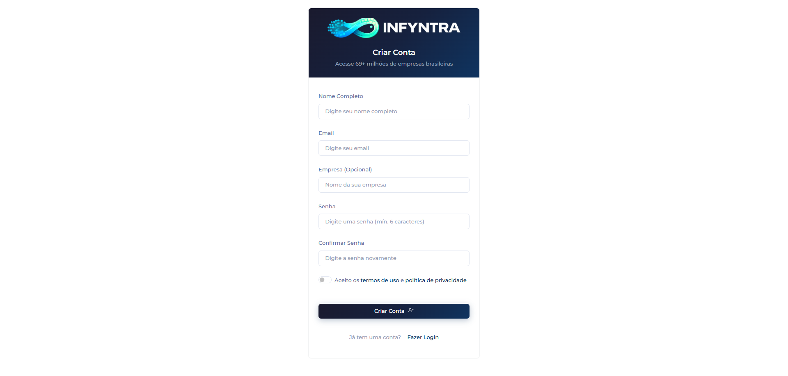

# 📸 Screenshots - Infyntra

**Conheça a interface da plataforma Infyntra**

*Capturas de tela reais do sistema em funcionamento*

---

## 🏠 **Dashboard Principal**

**Funcionalidades:**
- Métricas em tempo real
- Resumo de atividades
- Acesso rápido às principais funcionalidades
- Gráficos de performance

---

## 🔍 **Sistema de Busca Avançada**

**Recursos:**
- Filtros por estado, CNAE, porte
- Busca full-text inteligente
- Resultados em tempo real
- Paginação otimizada

---

## 🎯 **Classificador de Leads**

**Características:**
- Interface intuitiva Like/Maybe/Dislike
- Scoring automático com IA
- Processamento em lote
- Histórico de classificações

---

## 📊 **Análise de Mercado**

**Insights:**
- Distribuição geográfica
- Análise setorial (CNAE)
- Gráficos interativos
- Relatórios customizáveis

---

## 💼 **CRM Integrado**

**Gestão:**
- Lista completa de leads
- Status de qualificação
- Histórico de interações
- Pipeline de vendas

---

## 🔐 **Tela de Login**

**Segurança:**
- Autenticação segura
- Recuperação de senha
- Interface moderna
- Responsivo para mobile

---

## 📈 **Dashboard Analytics**

**Métricas:**
- KPIs principais
- Gráficos de performance
- Análise temporal
- Comparativos

---

## 📋 **Gestão de CNAEs**

**Funcionalidades:**
- Lista completa de setores
- Busca por código ou descrição
- Estatísticas por CNAE
- Filtros inteligentes

---

## 📝 **Histórico de Atividades**

**Rastreamento:**
- Log completo de ações
- Filtros por período
- Detalhes de cada operação
- Auditoria de uso

---

## 📊 **Estratégias de Vendas**

**Planejamento:**
- Templates de estratégias
- Análise de performance
- Metas e objetivos
- Acompanhamento de resultados

---

## 📝 **Scripts de Prospecção**

**Automação:**
- Biblioteca de scripts
- Personalização por segmento
- Templates prontos
- Histórico de uso

---

## ✅ **Gestão de Tarefas**

**Organização:**
- Lista de tarefas pendentes
- Priorização automática
- Lembretes e notificações
- Acompanhamento de progresso

---

## 💬 **Sistema de Feedbacks**

**Comunicação:**
- Feedbacks dos usuários
- Sistema de avaliações
- Sugestões de melhorias
- Comunicação direta

---

## 🎓 **Estudos de Produto**

**Conhecimento:**
- Materiais educativos
- Guias de uso
- Melhores práticas
- Casos de sucesso

---

## 📝 **Cadastro de Usuários**

**Onboarding:**
- Processo simplificado
- Validação em tempo real
- Integração com sistemas
- Configuração inicial

---

**Quer ver o Infyntra em ação?**

[🎥 **Agendar Demo**](https://matheus.stacksflow.io/) • [🚀 **Teste Gratuito**](https://matheus.stacksflow.io/)

*Experimente todas essas funcionalidades na prática*

